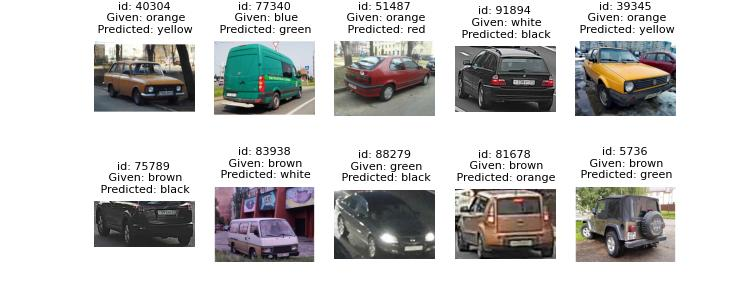
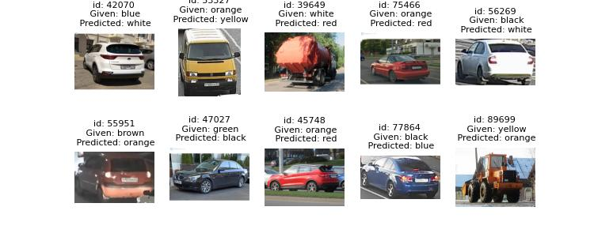
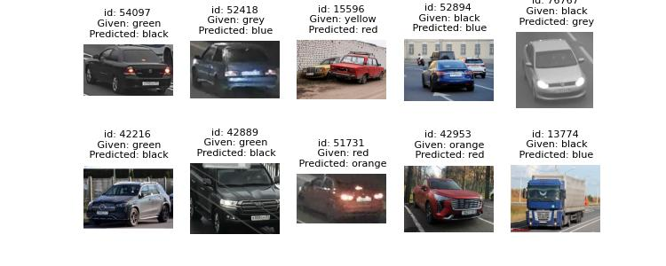

# Сервис выявления проблем в разметке датасетов классификации

## Как работает

Для выявления проблем в разметке используется этот [инструмент](https://github.com/cleanlab/cleanlab)

Данный сервис анализирует датасет в кастомном формате (описание ниже), выявляет кадры с проблемной разметкой и заменяет эту разметку на предикт от нейросети.

Полный пайплайн выглядит примерно так:

1) Датасет делится на несколько фолдов.
2) Под каждый фолд обучается своя нейросеть.
3) Каждая нейросеть делает предсказания для тестовой выборки своего фолда. Результаты объединяются.
4) Считаются статистики по некоторому списку признаков. Выявляются аномалии.
5) Результаты сохраняются туда, куда вам нужно. По необходимости кадры с проблемной разметкой визуализируются.

## Первоначальная настройка

Для начала вам необходимо подготовить датасет в jsonl формате.

У вас должна получиться папка со следующей структурой:

```
dataset_name
|
└───images
│   │   image_0.jpg
│   │   image_1.jpg
│   │   image_2.jpg
│   │   ...
│   
└───labels.jsonl

```

Файл "labels.jsonl" содержит аннотации. Выглядит это примерно так:

```json
{"image": "images/image_0.jpg", "label": "red"}
{"image": "images/image_1.jpg", "label": "green"}
{"image": "images/image_2.jpg", "label": "blue"}
...

```

Где "image" - путь до изображения относительно файла с аннотациями, а "label" - название класса.


Далее необходимо прописать пути в файле docker-compose.yaml

```yaml
...
    volumes:
      - ./path/to/dataset:/workspace/dataset  # Путь до датасета
      - ./configs/config.yaml:/workspace/configs/config.yaml # Путь до конфига
      - ./drawed/:/workspace/drawed # Путь для изображений с отрисовкой
...

```
Не меняйте пожалуйста пути внутри контейнера.

Осталось лишь настроить конфиг

```yaml

do_visualize: True  # Делать ли отрисовку найденных ошибок
num_images_to_vis: 500 # Количество примеров для отрисовки

Model:
    class_name: EfficientNetV2_s # Класс модели (можно найти в models/__init__.py)
    num_classes: 9 # Количество классов в датасете

Training: # Параметры обучения
  epochs: 15 # Количество эпох для каждой модели
  batch_size: 32 # Размер батча
  num_workers: 40 # Количество ядер под dataloader-ы
  patience: 2 # Число эпох "ожидания" для уменьшения lr
  warmup: 1 # Число эпох для warmup (можно указать нецелое) > 0
  lr: 0.0003 # Lr после warmup
  min_lr: 0.000005 # Минимальный lr
  factor: 0.9 # Коэфициент для уменьшения lr
  weighted_sampler: True # Балансировать ли датасет с помощью семплера

Dataset:
  num_folds: 5  # Количество фолдов
  dataset_path: /workspace/dataset/ # Путь до датасета внутри контейнера (не надо менять)

  names: ['black',  'blue',  'brown',  'green',  'grey',  'orange',  'red',  'white',  'yellow'] # Имена классов

  transform: # Аугментации и препроцессинг
    resize: 
        size: [224, 224] 

    rotation: 
        degrees: 35

    hflip: 
        p: 0.5
    
    vflip:
        p: 0.  

    perspective:
        distortion_scale: 0.1
        p: 0.2

    # color_jitter:
    #     brightness: 0.3
    #     contrast: 0.2
    #     saturation: 0.1
    #     hue: 0.1

    # random_crop: 
    #     size: [128, 128]

    # blur: 
    #     kernel_size: [5, 9]
    #     sigma: [0.1, 5]

# Если не хотите использовать что то из этого
# просто закомментируйте

```

Вам не нужна идеальная модель для поиска проблемной разметки, однако от предсказаний нейросетей зависит результат.

Поэтому подбирайте параметры на свое усмотрение, исходя из располагаемых времени и железа. 

Если не хотите париться можете не править конфиг, для большинства задач будет работать хорошо.


## Запуск

Когда все настроено нужно поднять контейнер

```
sudo docker compose up -d
```

## Результаты

Как только анализ завершится в папке датасета появится файл "corrected_labels.jsonl". Это новые, исправленные аннотации к датасету.

Отрисовку для проблемных изображений вы сможете посмотреть по пути, который указали в docker-compose


## Примеры отрисовки




